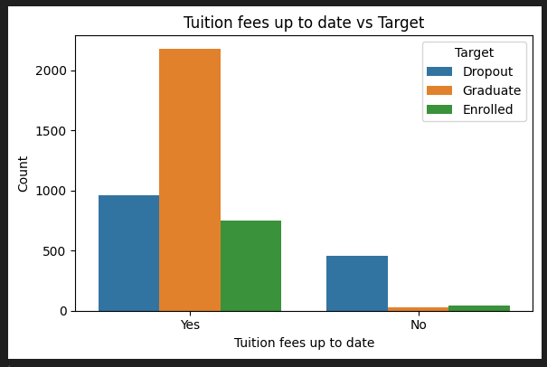
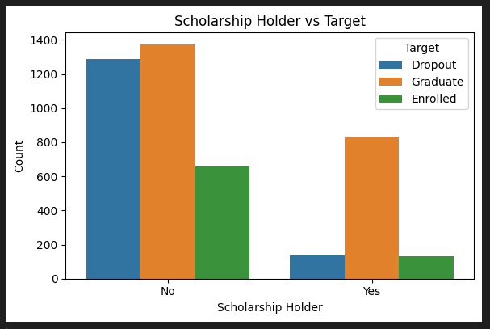
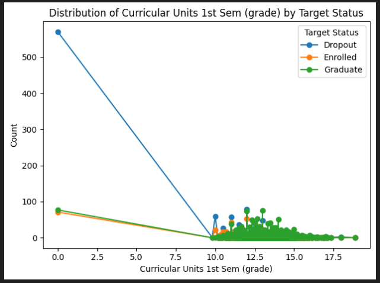
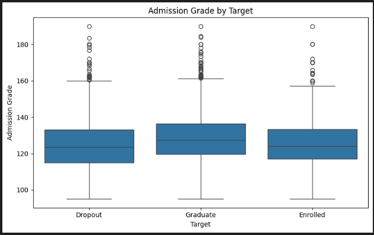

# What is your dataset and why did you choose it?
Link: https://archive.ics.uci.edu/dataset/697/predict+students+dropout+and+academic+success

I chose this dataset because I'm interested in seeing if there are causal effects between a student's environmental factors and their likelihood to dropout of higher education. This dataset includes variables I think that are important, such as marital status, financial situation, and parents' background in work and education. It also has a target variable that shows whether or not the student has dropped out.

# What did you learn from your EDA?
I think that there are some variables that are strongly correlated with how likely a student is to drop out. For example:

   
Students who aren't up to date with their tuition fees seem far more likely to drop out than students who are up to date.

   
Students who receive a scholarship are less likely to drop out.

   
(Grade scale 0-20)   
Students who receive a grade of 10.0 or less are likely to drop out.

There are also variables that are weakly correlated/not correlated with drop out rate. An example of this is admission grade:   

# What issues or open questions remain?
There is a class imbalance in the dataset because the majority of students have graduated, followed by dropped out and enrolled. I want to focus on factors that contribute to dropout, so I'm thinking about combining "graduate" and "enrolled" students together, so that the students could be split into either dropout or not dropout.    

Some of the variables also have a class imbalance, and I'm think I want to avoid using these in my model. For example, when I tried to see if there was any correlation between nationality and dropout, I found out that a large proportion of students were Portugese.   

There are some variables with many categories, and I want to group some of the categories together because I think some of them have similar correlations to dropout. But I would need to spend more time thinking about how I want to group them together and check how the groupings would affect my model performance. 
