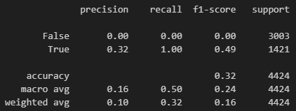
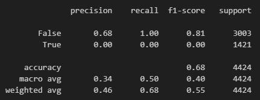
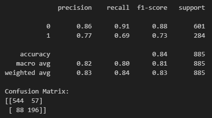
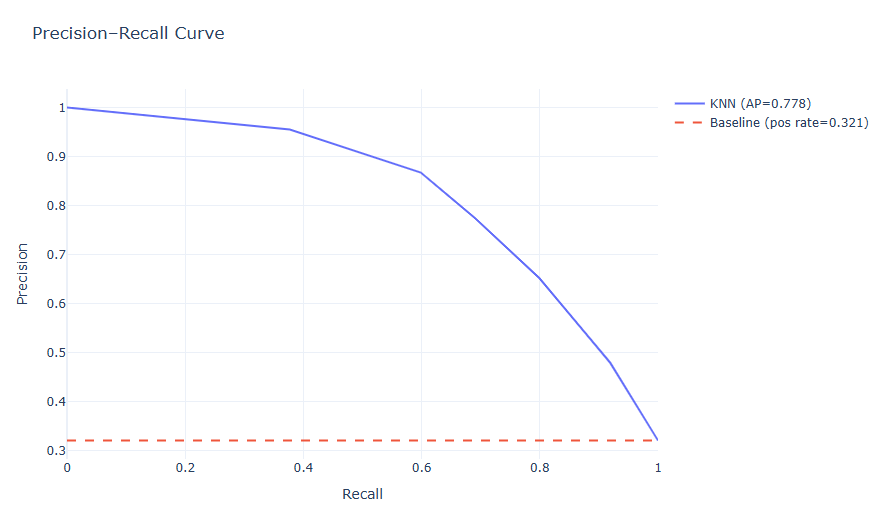
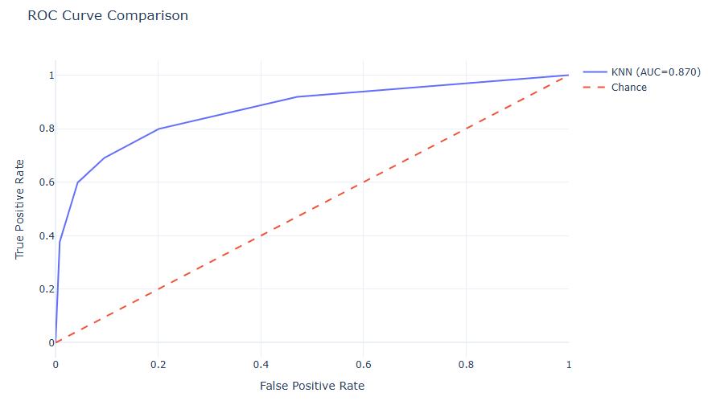
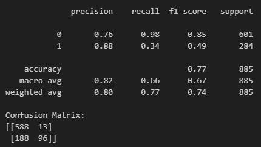

# Baseline Model

Predict that all students will drop out

Predict that all students will not drop out

## Strengths and Weaknesses

Strengths:  
My baseline model is easy to implement, and it provides a reference point to compare more complex models. Ideally, the models I develop should perform better than the baseline.

Weakness:  
There is a class imbalance between students who drop out and students who do not drop out. This means that the accuracy rate is deceptively high when I predict for students who do not drop out.

# Current Model

Features used:

- Daytime/evening attendance
- Debtor
- Tuition fees up to date
- Gender
- Scholarship holder

Currently, my best model is a KNN based model.
Although precision is lower compared to a random forest model or xgboost, recall and f1 score significantly better. This is the classification report for my random forest model for comparison:  

## Future Improvements

To further improve my KNN model, I plan to tune the number of neighbors to optimize precision. Additionally, I am interested in exploring clustering techniques to group similar students or aggregate related variables, which may enhance model performance by reducing redundant features or noise. 

Although my random forest model currently shows lower recall and F1 scores, I aim to improve its effectiveness through feature engineering (like the ones for my KNN model) and by experimenting with the number of trees (estimators). These adjustments may help the model better capture important patterns and address class imbalance, and hopefully perform better than my KNN.
