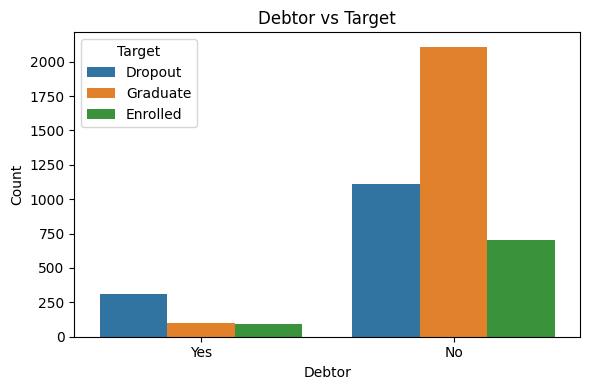
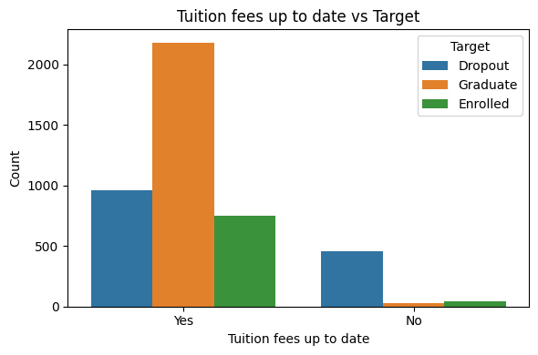
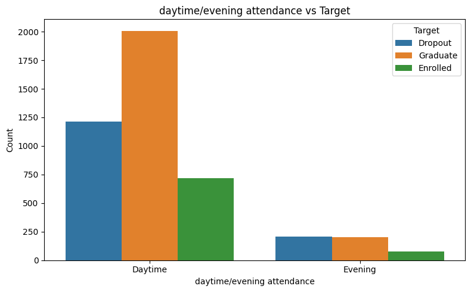
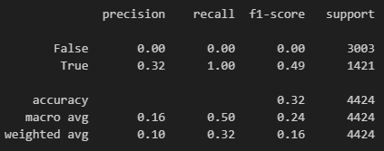
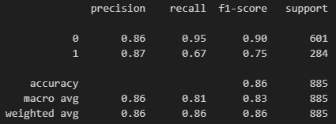
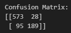
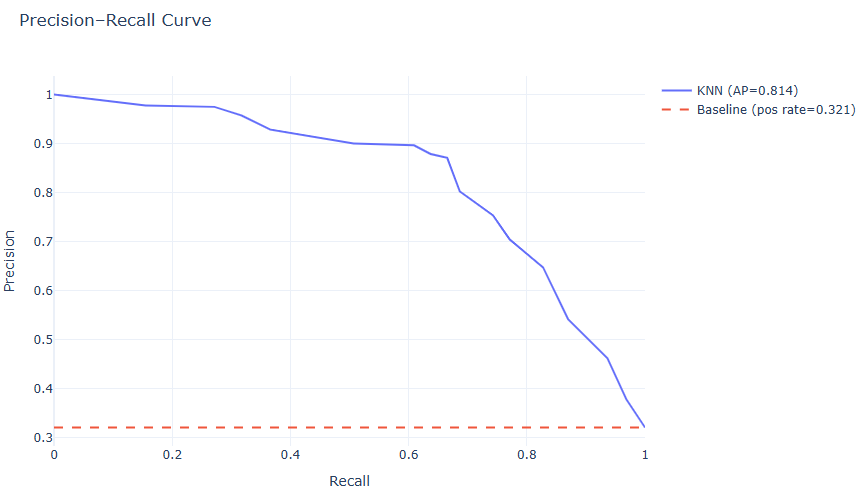
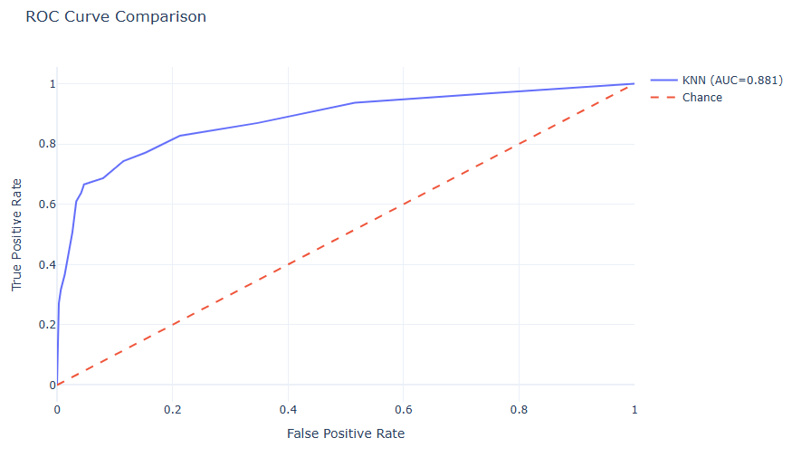

Predicting Student Dropout Using Machine Learning   
by Ida Voong

[Presentation](https://docs.google.com/presentation/d/1tpiimvbTDf-AU9pH94EAs_B8Wa9tXrFq587ooCkTHrk/edit?usp=sharing)

# Problem
Completing a college degree is strongly associated with lower unemployment rates, and many careers now require at least a bachelor's degree. A college education is essential for economic stability and upward mobility. 

Despite these benefits, a significant number of students leave college before earning a degree, which impacts their future employment opportunities and earning potential. Understanding why students dropout is vital for developing effective interventions that support student success.

# Dataset

[Link to Dataset](https://archive.ics.uci.edu/dataset/697/predict+students+dropout+and+academic+success)

Size: 4424

Key Variables: marital status, previous education level, nationality, gender, age, admission grade, parents' education level and occupation, grades, curriculum, debt, tuition payment, number of units enrolled in

Target Variable Values: dropout, graduate, enrolled

In the initial data exploration, I noticed that there are some variables that have a strong correlation with dropout rate:

My main focus is on predicting dropout, so I merged together students who have graduated, or are currently enrolled, such that the target variable is dropout vs not dropout. 

The dataset is split such that 80% is used for training and 20% for testing.

# Model

## Baseline Model
The baseline model predicts that all students will dropout. 

## Best Model
My best model is a KNN that uses 15 neighbors. The features used in this model are: 
- Daytime/evening attendance
- Debtor
- Tuition fees up to date
- Gender
- Scholarship holder
- Curricular units 1st sem (grade)
- Curricular units 2nd sem (grade)

These features are processed using one hot encoder and standard scalar before they are fed into the KNN model. 

The model is evaluated using precision, recall, and f1-score to determine how well it can predict whether or not a student will drop out. 

# Analysis
A student's financial situation strongly indicates whether or not they will dropout. We can see this correlation in the initial data exploration. Students with debt have a significantly higher chance of dropping out than those who do not. Similarily, students who have not paid their tuition on time are also likely to dropout. Whether or not a student holds a scholarship diretly affects how likely they are to pay their tuition.

Whether or not a student attends class during the day or evening is also correlated with increased dropout. I hypothesize that students who attend class in the evening may have other priorities that they tend to during the day, such as work. 

Lower grades also indicate a higher dropout rate. Students who perform poorly in their classes and/or cannot maintain a certain GPA may be forced to dropout of college.
